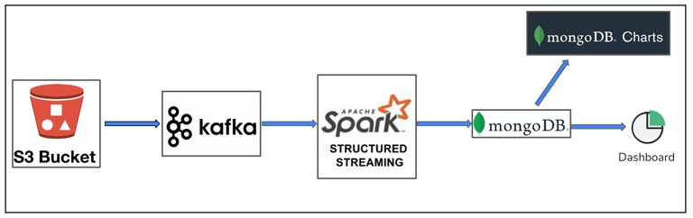
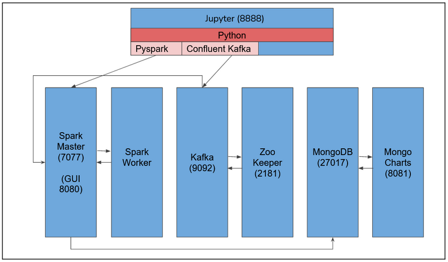
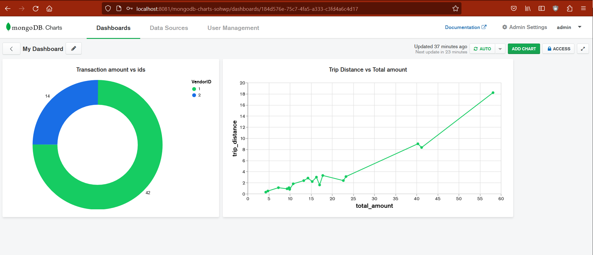

# Big-data-project-v2
AWS S3 -> kafka -> Spark -> MongoDB -> MongoCharts

## Preface
The volume of data being produced every second has been increasing exponentially recently. This calls for methods to look at data in a quick and effective way. Traditional techniques involved storing data into databases and running analytics jobs on them. This process takes so much time that eventually when insights are drawn from the data, it becomes irrelevant. Real-time analytics and monitoring is the way to go forward. This project is an attempt in the same direction and looks at NYC cab transactions in a real-time monitoring perspective and creates a dashboard for the same. 
## Data Source
https://www.kaggle.com/datasets/elemento/nyc-yellow-taxi-trip-data  
## ETL Pipeline
In this project, we are looking to create an ETL pipeline by streaming data from AWS S3 using Kafka and Spark to populate a MongoDB database and create a real-time dashboard using MongoDB charts as shown in the diagram below

## Architecture
To mimic the real world scenario as closely as possible, we have used each of the above mentioned technologies in different docker container instance. The architecture is as shown in the diagram below:

## Execution

1. Create an AWS account and use an S3 instance for your project. (This part is exclusive for our project because we have used our own AWS token key and secret key)
2. Put your dataset in the S3 instance and generate a new access code and secret key.
3. To execute this pipeline use git bash in windows / terminal on mac. (windows terminal doesn't support $pwd)
4. Use command: 

       docker-compose up -d
5. Open localhost:8888 using token as admin@123
6. Run the producer_demo notebook and in another tab run the consumer_demo notebook.
7. This will start populating the mongoDB database. Open localhost:8081 to see mongocharts. (admin@example.com, StrongPassw0rd)
8. You can see the charts update live as shown

